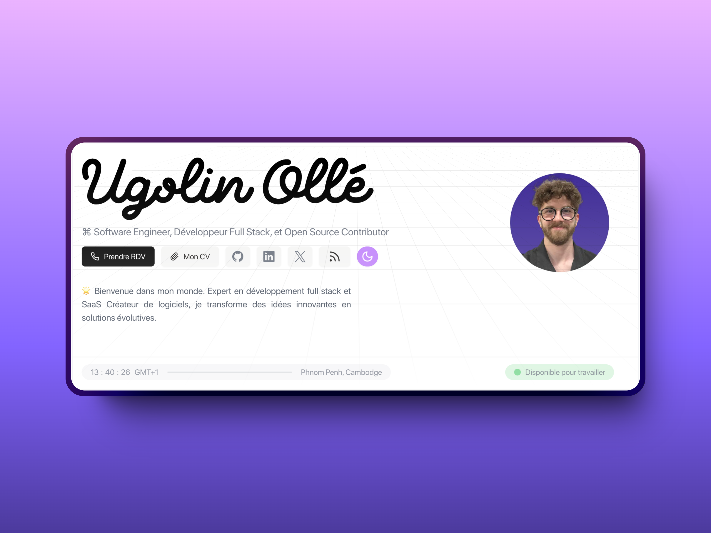

# Portfolio v2 🚀

<p align="center">
    
</p>

[](https://nextjs.org/)
[](https://www.typescriptlang.org/)
[](https://tailwindcss.com/)
[](https://www.framer.com/motion/)

## 💻 · Description

This is the second version of my personal portfolio, showcasing my projects and skills as a developer. Built with modern web technologies, it offers a sleek, responsive, and interactive user experience.

**Features:**

- 🎨 Responsive design for all devices
- ⚡ Fast page loads with Next.js
- 🌈 Smooth animations with Framer Motion
- 🧩 Type-safe development with TypeScript
- 🎭 Dark mode support
- 📊 Project showcase with detailed information
- 📝 Blog section (if applicable)
- 📬 Contact form

## 🛠️ · Technologies Used

- **Next.js**: For server-side rendering and optimized performance
- **TypeScript**: For type-safe code and better developer experience
- **TailwindCSS**: For rapid and responsive UI development
- **Framer Motion**: For smooth and engaging animations

## 🚀 · Getting Started

1. Clone the repository:

```bash
git clone https://github.com/your-username/portfolio-v2.git
```

2. Install dependencies:

```bash
cd portfolio-v2
npm install

or

yarn install

or

pnpm install
```

3. Run the development server:

```bash
npm run start:dev

or

yarn start:dev

or

pnpm start:dev
```

4. Open http://localhost:3000 in your browser to see the result.

🤝 · Contributing

While this is a personal portfolio, I'm open to suggestions and improvements. Feel free to open an issue or submit a pull request.

📜 · License

This project is open source and available under the MIT License.

📞 · Contact

Feel free to reach out to me for any questions or collaborations:

🌐 Website: ugolin-olle.com
📧 Email: hello@ugolin-olle.com
💼 LinkedIn: linkedin.com/in/ugolin-olle
🐦 Twitter: @ugolin_olle
